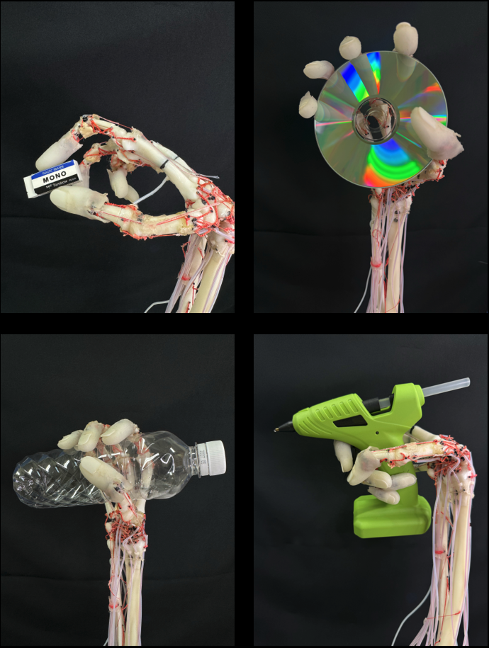

# 独立可動手根骨を有する人体模倣ソフトロボット前腕（Anthropomimetic Soft Robotic Forearm with Independently Articulated Carpal Bones）

📘 日本語版（このページ）  
🌍 [English](README.md)

---

## 概要



本リポジトリは、靭帯で連結された8個の独立可動手根骨・22本の駆動筋・柔軟指先からなる**解剖学的に忠実な人体模倣ソフトロボット前腕**と、その組立・実験治具のCADデータ、筋制御ファームウェア、手関節剛性および手根骨運動の解析コードを公開します。以下の論文の再現性向上を目的としたオープンハードウェアデータです。

Yoshinobu Obata, Yinlai Jiang, Hiroshi Yokoi, and Shunta Togo.  
“Anthropomimetic Soft Robotic Forearm with Independently Articulated Carpal Bones Enabling Human-Like Adaptive Stiffness Modulability.”  
arXiv:TODO [cs.RO], 2026.  
https://doi.org/TODO

---

## リポジトリ構成

```
analysis/   手関節剛性楕円のフィッティングと手根骨運動解析のコード・計測データ（Python）
firmware/   ロボット前腕の筋（Dynamixel）制御ファームウェア（PlatformIO）
cad/        前腕本体および実験・組立治具のCADデータ（STEP、F3D）
stl/        3Dプリント用STLデータ（骨・TFCC・モータタワー・組立／実験治具）
media/      補足動画
licenses/   適用ライセンスの全文（CC BY 4.0、CC BY-SA 2.1 JP）
```

---

## 必要部品（BOM）

- [部品表（BOM）](./BOM_JP.md)

---

## ライセンス

本リポジトリには、複数のライセンスが適用されています。  
骨モデルは **BodyParts3D**（ライフサイエンス統合データベースセンター）に由来するため **CC BY-SA 2.1 JP**、それ以外の著者らによるオリジナルデータは **CC BY 4.0** で提供されます。  
使用する際は、対象ファイルのライセンスを必ず確認してください。  
詳細は `LICENSE.txt` および `licenses/` フォルダ内のファイルを参照してください。

---

## 注意事項・免責

- 本データは研究用途を目的として提供されています。
- 本データの使用・改造・配布は自己責任で行ってください。
- 本リポジトリの内容を利用したことによるいかなる損害についても、作者は責任を負いません。

---

## 作者・連絡先

東郷 俊太  
電気通信大学大学院情報理工学研究科  
機械知能システム学専攻　准教授  
[ResearchMap](https://researchmap.jp/shuntatogo)  
[東郷研究室](http://www.hi.mce.uec.ac.jp/togolab/)  
[X](https://twitter.com/togo_lab/)  
[Instagram](https://www.instagram.com/togolab_uec/)  
[YouTube](https://www.youtube.com/channel/UC10spcvW8-pCTLKy5rrDHyw)

ご質問や不具合報告は GitHub Issues あるいは s.togo[at]uec.ac.jp まで。

東郷研究室では、教育・研究活動へのご支援も歓迎しています。  
[電気通信大学基金](https://www.uec.ac.jp/kikin/archives/fund/togolab)

---

## 関連発表

* Yoshinobu Obata, Yinlai Jiang, Hiroshi Yokoi and Shunta Togo, “Design of anthropomimetic robotic wrist joint and forearm,” 2023 IEEE International Conference on Systems, Man, and Cybernetics (SMC), pp. 1766–1771, Oahu, Hawaii, USA, Oct. 1-4, 2023.
* 小畑 承経，姜 銀来，横井 浩史，東郷 俊太，”ヒト手首関節剛性の可変性を有する人体模倣ロボット手首の開発”，ロボティクス・メカトロニクス講演会2026，2P1-R06，福岡国際会議場，2026年6月28日–7月1日．
* 小畑 承経，姜 銀来，横井 浩史，東郷 俊太，“人体の筋骨格構造を模倣したロボット手指・手首および前腕の開発”，ロボティクス・メカトロニクス講演会2024，2A2-J06，ライトキューブ宇都宮，2024年5月29日–6月1日
* 小畑 承経，姜 銀来，横井 浩史，東郷 俊太，“人体の筋骨格構造を模倣したロボット手首および前腕の開発” ，第41回日本ロボット学会学術講演会，1B3-02，仙台国際センター，2023年9月11–14日．
